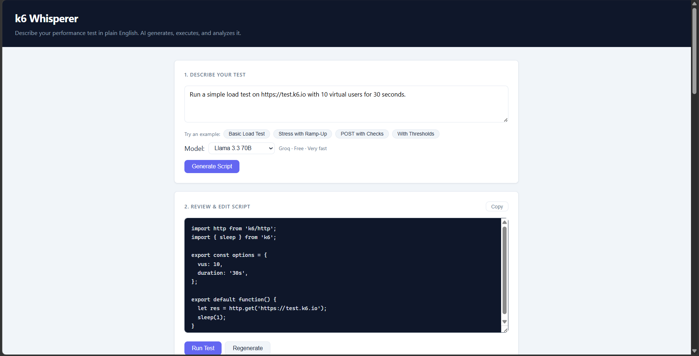
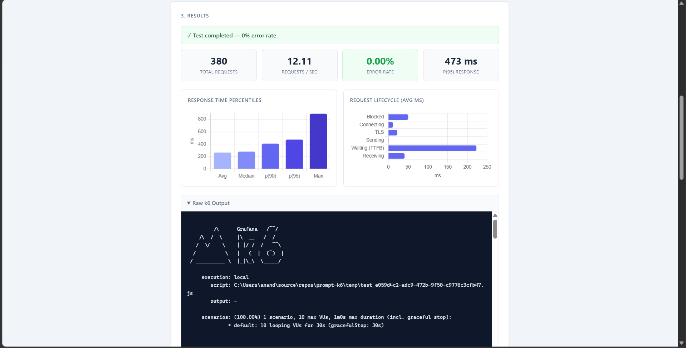
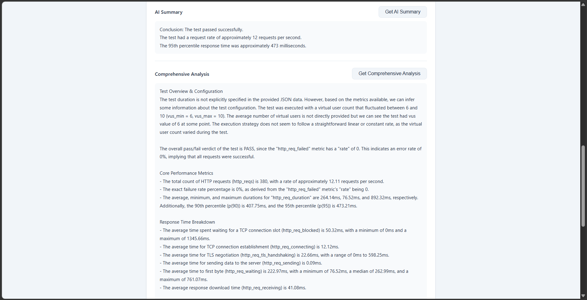

# k6 Whisperer — AI-Powered k6 Performance Testing Tool

[](https://nodejs.org/)
[](https://k6.io/)

> Transform natural language into powerful k6 performance tests with AI. No more manual scripting — just describe what you want to test.

A web-based interface for the open-source load testing tool [k6](https://k6.io/). Describe a performance test in plain English, and the application generates, executes, and analyzes it using your choice of AI model.


## Features

- **Natural Language Interface**: Describe tests in plain English (e.g., "stress test my login endpoint with 100 users for 5 minutes")
- **Multi-Provider AI Support**: Choose from Google Gemini, Groq (Llama, Gemma), OpenRouter, or a local Ollama instance — only models with configured API keys appear in the selector
- **AI-Powered Script Generation**: An LLM translates your prompt into a complete, executable k6 JavaScript script
- **Editable Scripts**: Review and modify the generated script before running it
- **Automated Test Execution**: The Node.js backend runs the script via k6 and captures results
- **Results Visualization**: Live metric cards (RPS, error rate, p(95)) and charts — response time percentiles and request lifecycle breakdown
- **AI Result Analysis**: Quick summary or full comprehensive breakdown covering response times, bottlenecks, SLA comparisons, and recommendations
- **Sample Prompts**: One-click example prompts for quick demos

## Screenshots

### Describe Your Test


### Results and Charts


### AI Summary and Comprehensive Analysis


## Tech Stack

- **Backend**: Node.js, Express.js
- **Frontend**: HTML, CSS, Vanilla JavaScript, Chart.js
- **Performance Testing Engine**: Grafana k6
- **AI Providers**: Google Gemini, Groq, OpenRouter, Ollama
- **Architecture**: RESTful API — generate → review → run → analyze pipeline

## Getting Started

### Prerequisites

1. **Node.js** v18+ — [nodejs.org](https://nodejs.org/)
2. **k6** — [k6.io/docs/getting-started/installation](https://k6.io/docs/getting-started/installation/)
3. **At least one AI provider API key** (see options below)

### AI Provider Options

You only need one. Groq is the recommended starting point — free, no credit card required.

| Provider | Free? | Get Key |
|---|---|---|
| **Groq** | Yes | [console.groq.com](https://console.groq.com) |
| **Google Gemini** | Yes (free tier) | [aistudio.google.com](https://aistudio.google.com) |
| **OpenRouter** | Yes (free models) | [openrouter.ai](https://openrouter.ai) |
| **Ollama** | Yes (local) | [ollama.com](https://ollama.com) — no key needed |

### Installation

1. Clone the repository

```
git clone https://github.com/your-username/k6-whisperer.git
cd k6-whisperer
```

2. Install dependencies

```
npm install
```

3. Set up environment variables

```
cp .env.example .env
```

Open `.env` and fill in the API key(s) for the provider(s) you want to use. Keys you leave blank simply won't appear in the model selector.

4. Start the server

```
npm start
```

5. Open http://localhost:3000

## How to Use

1. **Select a model** from the dropdown — only configured models are shown
2. **Describe your test** — type a prompt or click a sample prompt chip
3. **Review the generated script** — edit it if needed
4. **Run the test** — results appear with a live pass/fail status badge, metric cards, and charts
5. **Get AI analysis** — quick summary or full comprehensive breakdown

### Sample Prompts

- **Basic Load Test**: `Run a simple load test on https://test.k6.io with 10 virtual users for 30 seconds.`
- **Stress Test with Ramping**: `Create a stress test for https://test.k6.io/news.php. Start with 5 users, ramp up to 30 users over 45 seconds, then stay at 30 users for another 30 seconds.`
- **POST Request with Checks**: `Test the POST endpoint at https://test.k6.io/flip_coin.php. Send a payload with bet=heads for 20 seconds using 5 virtual users. Add a check to verify the HTTP status is 200.`
- **Test with Thresholds**: `Run a load test on https://test.k6.io/pi.php?decimals=8 for 30 seconds with 15 users. Add a threshold to fail the test if the 95th percentile response time exceeds 900 milliseconds.`

## Troubleshooting

**No models appear in the selector**
- At least one API key must be set in `.env`
- Restart the server after editing `.env`

**AI generated an invalid script**
- Try rephrasing your prompt to be more specific
- Switch to a more capable model (Llama 3.3 70B on Groq or any Gemini model)

**k6 command not found**
- Ensure k6 is installed and available in your PATH
- Restart your terminal after installation

**Groq / OpenRouter rate limit errors**
- Free tiers have rate limits — wait a moment and retry
- Switch to a different model in the selector

**Ollama models not appearing**
- Ensure Ollama is running: `ollama serve`
- Pull the model first: `ollama pull llama3`
- Verify `OLLAMA_BASE_URL` in `.env`

**Connection refused (local endpoint testing)**
- Ensure your local server is running on the expected port
- Check firewall settings

## Contributing

1. Fork the repository
2. Create a feature branch (`git checkout -b feature/your-feature`)
3. Commit your changes (`git commit -m 'Add your feature'`)
4. Push to the branch (`git push origin feature/your-feature`)
5. Open a Pull Request

## Acknowledgments

- [Grafana k6](https://k6.io/) for their excellent open-source load testing tool
- [Groq](https://groq.com/), [Google Gemini](https://ai.google.dev/), [OpenRouter](https://openrouter.ai/), and [Ollama](https://ollama.com/) for AI inference
- [Chart.js](https://www.chartjs.org/) for visualization